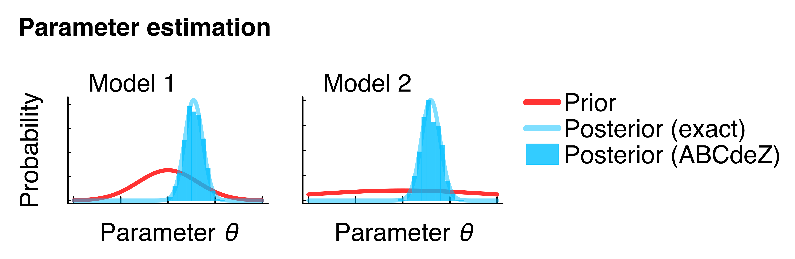

```@meta
CurrentModule = ABCdeZ
```

# ABCdeZ.jl

Approximate Bayesian Computation (**ABC**) with differential evolution (**de**) moves and model evidence (**Z**) estimates.

ABCdeZ.jl offers Bayesian parameter estimation and model comparison/selection for inference problems with an intractable likelihood. Models only need to be simulated (instead of calculating the likelihood). In this documentation you will find everything to get started.

```@contents
```

ABCdeZ.jl was developed [@TSB](https://www.dkfz.de/en/modellierung-biologischer-systeme/) by [Maurice Langhinrichs](mailto:m.langhinrichs@icloud.com) and Nils Becker. This work is based on many people's previous achievements, particular some part of the code base was adapted from [KissABC.jl](https://github.com/francescoalemanno/KissABC.jl) [^1]; please find a complete list of references [below](#References).

## Brief introduction

Bayesian inference allows to update a parameter prior ``p(θ | M)`` in the light of new data ``D`` to obtain posterior knowledge as

```math
p(θ | D, M) = \frac{p(D| θ, M) \, p(θ | M)}{Z}
```

where ``θ`` are the parameters of model ``M``, ``p(D| θ, M)`` the likelihood and ``Z = p(D | M)`` is the model evidence (also known as marginal likelihood). The model evidence is the normalising integral 

```math
Z \equiv p(D | M) = \int \, p(D| θ, M) \, p(θ | M) \, \mathrm{d}θ.
```

Next to parameter estimation, Bayes' theorem also applies to the outer layer for model selection/comparison, updating (by the same data) model prior probabilities ``p(M)`` to posterior probabilities as 

```math
p(M | D) = \frac{p(D | M) \, p(M)}{p(D)}
```

where the model evidences reappear as the essential factors, and ``p(D) = \sum_i p(D | M_i) \, p(M_i)`` is a normalisation factor over all models ``M_i`` (``i = 1,...,n``).

**ABC** (Approximate Bayesian Computation) approximates the likelihood through model simulations [^2], yielding simulated data ``D'`` that are evaluated with a kernel ``π_ϵ(D' | D)``,

```math
\hat{p}(D| θ, M) = \int \, p(D' | θ, M) \, π_ϵ(D' | D) \, \mathrm{d}D',
```

where ``ϵ ≥ 0`` specifies the width of the kernel. Under certain conditions, it can be shown that this approximation converges for ``ϵ \rightarrow 0`` [^2], keeping only model simulations ``D'`` that are "very close" to the original data ``D``.

These equations show in brief, that posterior parameter and posterior model probabilities can be obtained by updating (model and parameter) priors through some data ``D``, only requiring model simulations and a sufficiently small target ``ϵ\approx 0``. 

ABCdeZ.jl will provide parameter samples approximating the posterior ``p(θ | D, M)`` and estimations of (logarithmic) model evidences ``\mathrm{log}Z``.

## ABCdeZ.jl

ABCdeZ.jl currently implements two main ABC methods:

- [abcdesmc!](#Inference-by-abcdesmc!) (from "abc de **smc**"): A Sequential Monte Carlo algorithm. For posterior samples *and* model evidence estimates. Method of choice for multimodal or complex posterior landscapes.

- [abcdemc!](#Inference-by-abcdemc!) (from "abc de **mc**"): A simpler MCMC algorithm. For posterior samples only. "Greedy" algorithm that may be faster than ```abcdesmc!``` for some problems. May have difficulties with multimodal problems (use ```abcdesmc!``` instead).

Both methods make differential evolution (**de**) proposals for the MCMC (Markov chain Monte Carlo) steps of the algorithms; differential evolution provides a good scale and orientation to explore the (often) complex multi-dimensional parameter spaces effectively [^4]. For more information on both algorithms follow the respective links above.

**Why ABCdeZ.jl?**

- If you want to perform parameter estimation and/or model comparison, but it is difficult to compute the likelihood for your models (time-consuming and/or analytically unknown). ABC is a likelihood-free approach, the only requirement is that you can simulate your models, given values for their parameters.
- ABCdeZ.jl allows to compute model evidences directly and hence the results are future-proof. Model selection in ABC is often done by simulating all models of interest in the same ABC run. With ABCdeZ.jl you can run models individually, store the resulting evidence (and ``ϵ``'s) and compute evidences of any other models later, without re-computing the first. In the end, the desired set of models can be compared by transforming their evidences into posterior model probabilities or Bayes factors.
- ABCdeZ.jl offers fast thread-based parallelism by enabled by [FLoops.jl](https://github.com/JuliaFolds/FLoops.jl) [^10]. Additionally it also allows to store arbitrary data ```blobs``` together with the sample particles (e.g., to have the simulation output alongside the final posterior samples). For more information see [here](#Features-for-the-distance-methods).

**Why not ABC(deZ.jl)?**

- If you *can* calculate the likelihood function for your models, make use of it. Instead of ABC, consider likelihood-based inference methods.
- Please be aware of the **caveats of ABC**, particular for model comparison/selection. ABC is approximative and may lead to wrong/misleading results if not applied carefully (see [here](#ABC-Approximations) for more).

## Minimal example

Here we will use ABCdeZ.jl to infer the model evidences and posterior distributions within a simple toy example. The models have a single parameter ``θ`` that is, *a priori*, normally distributed (prior). After seeing one single data point, we obtain an updated posterior knowledge. To obtain model evidences, next to the posterior samples, we will use the [```abcdesmc!```](#Inference-by-abcdesmc!) method; for posterior samples only one may also use ```abcdemc!``` with a very similar syntax (as seen [here](#Inference-by-abcdemc!)).

ABCdeZ.jl (as ABC in general) requires model simulations (for samples of ``θ``) only, and not the likelihood values (at these ``θ``). However, in this simple example the likelihood is available and chosen in a way (also ```Normal```) that the prior is conjugate, and the exact posterior distributions and evidences are known analytically. We will compare the inferences made by ABCdeZ.jl with the analytical counterparts.

We load the required packages, set the single data point and the target ``ϵ`` for the ABC runs.

```julia
using ABCdeZ
using Distributions

### data
data = 3

### ABC target ϵ (maximum distance)
ϵ = 0.3
```

Then we set up the inference of a first model. The normal prior is specified via ```Distributions``` (for more see "Prior" box below). Note that the model is solely specified by a 
random simulation for a given ``θ``. The distance function here simply reports the absolute distance between the random model output and the single data point (see [here](#Features-for-the-distance-methods) for additional features in the distance function).

```julia
### model 1 inference
σ₁² = 10
prior1 = Normal(0, sqrt(σ₁²))

# model simulation (to replace likelihood)
model1(θ) = rand(Normal(θ, 1))

# distance function between model and data
dist1!(θ, ve) = abs(model1(θ)-data), nothing
```

With the following line we run the ```abcdesmc!``` method of ABCdeZ.jl. The inference result is stored in ```r1```.

```julia
### ABC run
# run the smc method for model 1
r1 = abcdesmc!(prior1, dist1!, ϵ, nothing, 
                    nparticles=1000, parallel=true)
```

From the result ```r1``` we can read out the posterior samples (important: weighted by ```Wns```, 
see box "Posterior sample weights" [here](#Inference-by-abcdesmc!)) and the estimated model evidence for model 1 (transforming back from log-scale).

```julia
### process results
# posterior parameters
posterior1 = [t[1] for t in r1.P[r1.Wns .> 0.0]]

# model evidence (logZ is the logarithmic evidence)
evidence1 = exp(r1.logZ)
```

Plotting the ```posterior1``` samples as a histogram, one can see the gained knowledge from the 
prior just by the single data point (Figure below, left panel). The samples also match the analytical posterior, available in this simple example.

```@raw html

```

To demonstrate model comparison enabled by ABCdeZ.jl, we now repeat the procedure with a 
second model. Here, for simplicity, model 2 only differs from model 1 in the prior; of course 
in more interesting settings, not only the prior, but the whole architecture of models 
may be different (kind of and/or number of parameters). Any models can be compared in principle; 
as long as inferences are done for the same (summary) data (and simulations always match the structure of the data), distance method (here ```abs()```) and 
target ``ϵ``. The same target ``ϵ`` is important in ABCdeZ.jl due to the (typically) unnormalised 
ABC kernel (see box "Model evidence (off by a factor)" [here](#Inference-by-abcdesmc!); if not possible, advanced info [here](#More-on-model-evidences)).

```julia
### model 2 inference
σ₂² = 100
prior2 = Normal(0, sqrt(σ₂²))

model2(θ) = model1(θ)

dist2!(θ, ve) = abs(model2(θ)-data), nothing

r2 = abcdesmc!(prior2, dist2!, ϵ, nothing, 
                    nparticles=1000, parallel=true)

posterior2 = [t[1] for t in r2.P[r2.Wns .> 0.0]]
evidence2 = exp(r2.logZ)
```

The posterior inference of model 2 is visually very similar to model 1, except the difference in the prior (Figure above, right panel).

Finally, the estimated evidences can be used to compute posterior model probabilities (based on equations [here](#Brief-introduction)). The model prior is uniform between the two models here.

```julia
### model probabilities
# model priors (uniform here)
mprior1 = 0.5
mprior2 = 0.5

# model posterior probabilities
mposterior1 = evidence1*mprior1 / (evidence1*mprior1 + evidence2*mprior2) # posterior prob. model 1
mposterior2 = evidence2*mprior2 / (evidence1*mprior1 + evidence2*mprior2) # posterior prob. model 2
```

The model probabilities can be visually compared (Figure below), recovering the exact analytical results. Note that evidence values by ABCdeZ.jl are numerically uncertain (see box "Uncertainty of model evidence" [here](#Inference-by-abcdesmc!)); as such the figure below also shows evidence values from repeated runs.

```@raw html

```

The complete code for this minimal example, including the derivation of the 
analytical counterparts, can be found on [GitHub](https://github.com/mauricelanghinrichs/ABCdeZ.jl/blob/main/examples/minimal_example.jl).

!!! note "Prior"

    Multidimensional prior distributions (continuous, discrete or mixed) can 
    be specified via the [`Factored()`](#Distributions-and-Priors) syntax (from 
    independent 1d marginals), e.g. `prior2d = Factored(Normal(0, sqrt(10)), 
    DiscreteUniform(1, 10))`.

## Inference by abcdesmc!

```@docs
abcdesmc!
```

!!! warning "Posterior sample weights"

    Posterior samples obtained by `abcdesmc!` have to be associated with their weights (`r.Wns`). 
    With an indicator ABC kernel (default) there are just two weights (i.e. alive and dead 
    particles) and the correct posterior samples are hence given by 
    `posterior = [t[1] for t in r.P[r.Wns .> 0.0]]` (for the first parameter here).

!!! warning "Model evidence (off by a factor)"

    The model evidence estimates from the `abcdesmc!` method obtained by the default ABC 
    indicator kernel are off by a normalisation factor coming from an unnormalised 
    kernel (the one used in the final iteration). To do model selection/comparison 
    this means that evidence estimates for the set of models have to be done for the same 
    data (or summary statistics), distance function, ABC kernel *and* the same target 
    ϵ (which is `ϵ_target` if run not stopped by `nsims_max`). Then the (unknown) 
    normalisation factor is the same for all models and does not matter (cancels) for 
    Bayes factors or posterior model probabilities. See [here](#More-on-model-evidences)
    for workarounds if ϵ is not the same.

!!! tip "Uncertainty of model evidence"

    As of now the `abcdesmc!` method does not provide a (numerical) uncertainty for the model evidence 
    estimate from a single run. It may be however very useful to check for this when doing 
    model comparison (as the resulting Bayes factors or posterior model probabilities are 
    uncertain as well). So, if the runtime permits, run the `abcdesmc!` method multiple times 
    and collect the resulting set of evidence values for `mean`/`median` and `std` estimates.

## Inference by abcdemc!

```@docs
abcdemc!
```

!!! warning "Greediness of abcdemc!"

    The `abcdemc!` method implements a "greedy"/biased Metropolis-Hasting step in the 
    Markov chain. This allows a fast convergence, particularly well-suited for unimodal 
    problems. However, to obtain valid posterior estimates the algorithm needs to 
    converge (all particles below `ϵ_target` and `r.reached_ϵ==true`). Otherwise the samples will be 
    biased (closer to the MAP (maximum a posteriori probability) parameter values 
    with reduced variation).


!!! note

    In contrast to the `abcdesmc!` method the resulting posterior samples of the `abcdemc!` 
    method are *not* associated with weights and can be used directly, i.e. 
    `posterior = [t[1] for t in r.P]` (for the first parameter here).

## Distributions and Priors

```@docs
Factored
```

```@docs
pdf
```

```@docs
logpdf
```

```@docs
rand
```

```@docs
length
```

## Various notes

#### ABC - Approximations

ABC is an approximate method, with approximation errors coming from typically two sources [^2]:

1) The kernel width ``ϵ`` (or target distance of an indicator kernel). Except for some discrete problems (where exactness may be reached with ABC and ``ϵ=0``), ``ϵ`` is chosen ``>0`` which introduces an approximation error (see [intro](#Brief-introduction)). Hence, the choice of ``ϵ`` is a trade-off between accuracy and runtime.

2) Summary statistics instead of the complete data. Often data and model simulations are both reduced to some summary statistics (e.g., mean values) before they are compared with a distance function. If the summary statistics are sufficient (for parameter estimation or, more stringent, model comparison), ``ϵ`` remains the only approximation. However, often the summary statistics are *not* sufficient, causing another level of inaccuracy that needs to be checked/controlled for. This is particularly important for model comparison (also see [below](#More-on-model-evidences) and [^2] [^7] [^8] and many more in the literature).

#### More on model evidences

**Effect of summary statistics on model selection:**
Summary statistics may introduce a second source of approximation error. This needs to specifically kept in mind for model selection, as results may become entirely uninformative or wrong [^2] [^7]. Note that a summary statistic may be sufficient for parameter estimation for two models individually, but can be entirely useless for model selection between these two models [^2]. It is hence critical to choose summary statistics that are sufficient or at least near-sufficient for the task of model selection. Marin et al. (2014) [^7] provide a procedure to control for this (also more briefly described on stackexchange [^8]).

**Comparison of models with different final ϵ:**
Models should be compared based on evidence values computed for the *same* final ``ϵ`` (due to kernel normalisation factor, as mentioned [here](#Inference-by-abcdesmc!) or in the [minimal example](#Minimal-example)). Still, there may be cases where this is not possible. There are two potential workarounds:

1) Run the ```abcdesmc!``` method with option ```verboseout=true```. Then the inference result ```r``` will contain the complete list of (logarithmic) evidence values (```r.logZs```) for each sequential ``ϵ`` (```r.ϵs```). For models with different final ``ϵ`` (```r.ϵ```), but ``ϵ`` values in the list that are somewhat similar, one may use the smallest similar ``ϵ`` and the respective evidence values for each model to compare them.

2) For a model ``B`` that seems worse than a current best model ``A``, it may be hard to run ABC for model ``B`` targeting the same small ``ϵ_A`` of model ``A``. A conservative evidence value for model ``B`` is the evidence obtained for another higher ``ϵ_B > ϵ_A`` (artificially favoring ``B`` compared to ``A`` at ``ϵ_A``). Using such evidences for the (qualitative) task of model selection is fine, as long as model ``B`` is still defeated by model ``A``, as one does not make misleading conclusions.

#### Features for the distance methods

  - In the distance function in the [minimal example](#Minimal-example)
    (`dist!(θ, ve) = abs(model(θ)-data), nothing`) 
    `ve` are "external variables" (`varexternal` in `abcdemc!` and `abcdesmc!`) that can 
    be used in the distance computation and mutated in-place, even in the parallel mode 
    (each thread will obtain its own copy for thread-safe parallel ABC runs).
    `ve` is passed as 4th positional argument to `abcdesmc!` (`nothing` in the 
    minimal example).

  - In the distance function in the [minimal example](#Minimal-example)
    (`dist!(θ, ve) = abs(model(θ)-data), nothing`) 
    the second return argument (`nothing`) can be used to store arbitrary data 
    (`blobs`) to each particle; these `blobs` will be associated with the final 
    posterior samples/particles in the end. For example `blobs` could record the 
    actual simulation output:

    ```julia
    function dist2!(θ, ve, constants, data)
        # constants can be used to pass thread-safe constants that are NOT mutated;
        # ve for in-place, mutatable variables

        # distance method
        simdata = model(θ)
        blob = simdata
        d = abs(simdata-data)
        d, blob
    end
    dist2!(θ, ve) = dist2!(θ, ve, nothing, data)

    r = abcdesmc!(prior, dist2!, ϵ, nothing, 
                        nparticles=1000, parallel=true)

    posterior = [t[1] for t in r.P[r.Wns .> 0.0]]
    evidence = exp(r.logZ)
    blobs = r.blobs[r.Wns .> 0.0]
    ```

## References

- Some part of the code was copied, adapted and/or inspired by KissABC.jl [^1]. For example, 
    the `Factored` syntax was adopted, `abcdemc!` is based on `ABCDE`, `abcdesmc!` is loosely based on 
    `smc`. We thank the developers of the package.
- A very good theory background for the general approach of model evidences from single ABC runs 
    is given by Didelot et al. (2011) [^2]. More details on algorithms (in the likelihood-context) is found in Llorente et al. (2020) [^3].
- The differential evolution moves are introduced in Ter Braak (2006) [^4].
- As done also in KissABC.jl [^1], the implementations of the `abcdemc!` method are a simplified 
    version of the method in Turner et al. (2012) [^5]. The algorithmic idea in `abcdesmc!` is mostly based on Amaya et al. (2021) [^6],
    next to KissABC.jl, particular the handling of weights and the adaptive differential evolution move tuning (Amaya et al. (2021) is 
    in the likelihood context, which we adapted to ABC).
- Closer read on sufficient summary statistics for model comparison in ABC is found in Marin et al. (2014) [^7] and condensed in this 
    stackexchange post [^8].
- Stratified resampling (for `abcdesmc!`) is inspired by Douc et al. (2005) [^9].
- For fast thread-based parallelism we make use of FLoops.jl [^10].

[^1]: 
    
    [KissABC (https://github.com/francescoalemanno/KissABC.jl)](https://github.com/francescoalemanno/KissABC.jl)

[^2]: 
    
    [Didelot et al. "Likelihood-free estimation of model evidence." Bayesian Anal. 6 (1) 49 - 76, 2011.](https://doi.org/10.1214/11-BA602)

[^3]: 
    
    [Llorente et al. "Marginal likelihood computation for model selection and hypothesis testing: an extensive review" arXiv:2005.08334 [stat.CO], 2020.](https://arxiv.org/abs/2005.08334)

[^4]:
    
    [Ter Braak. "A Markov Chain Monte Carlo version of the genetic algorithm Differential Evolution: easy Bayesian computing for real parameter spaces" Statistics and Computing volume 16, pages 239–249, 2006.](https://link.springer.com/article/10.1007/s11222-006-8769-1)

[^5]:

    [Turner et al. "Approximate Bayesian computation with differential evolution"  Journal of Mathematical Psychology, 2012.](https://compmem.org/assets/pubs/Turner.Sederberg.2012.pdf)

[^6]:
    
    [Amaya et al. "Adaptive sequential Monte Carlo for posterior inference and model selection among complex geological priors" arXiv:2105.02012 [physics.geo-ph], 2021.](https://arxiv.org/abs/2105.02012)

[^7]:
    
    [Marin et al. "Relevant statistics for Bayesian model choice" J. R. Statist. Soc. B, 2014.](https://www.jstor.org/stable/24774605)

[^8]:

    [https://stats.stackexchange.com/questions/26980/abc-model-selection](https://stats.stackexchange.com/questions/26980/abc-model-selection)

[^9]:
    
    [Douc et al. "Comparison of Resampling Schemes for Particle Filtering" arXiv:cs/0507025 [cs.CE], 2005.](https://arxiv.org/abs/cs/0507025)

[^10]:

    [FLoops (https://github.com/JuliaFolds/FLoops.jl)](https://github.com/JuliaFolds/FLoops.jl)

## Index

```@index
```